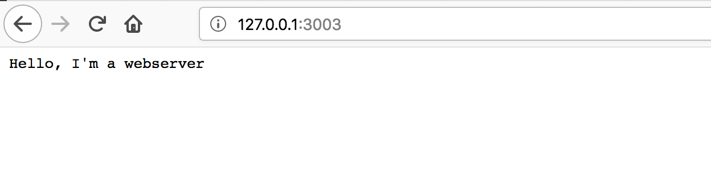

# build-a-http-server
Short tutorial in PHP to showcase how HTTP works for a class of students

## Required reading
* [Networking zine by @jvns](https://jvns.ca/networking-zine.pdf) (pay close attention to page 5)

## Introduction
All of us have used web browsers to serve the web. Meaning we entered:
`http://myfavouritewebsite.com:80/catz/catz/catz/chocolate` or something similar
into the address field of something similar to: Firefox, Safari, Edge or Chrome.

But how does that work? Below the surface ([in some cases literally](https://www.youtube.com/watch?v=H9R4tznCNB0)) a connection is between two machines. Your machine requests a thing from another machine.
That machine interprets the request and gives it a suitable response, based on 
the protocol, address, port and the path. A URL breaks apart like this:

* `http://` is the protocol
* `myfavouritewebsite.com` is the address (this will be translated to an IP-Address)
* `:80` is the port. Port 80 (or 443 for https) is the default so you don't have to add it
*  `catz/catz/catz/chocolate` is the path


The machine that receives the request will use the webserver to understand (parse)
what is requested and to create a suitable response.

## What is a web server?
But what is a web server you might ask?


A web server runs on a machine (physical server) and is connected to the internet. It is not really doing anything until someone sends it a request.

In order for the connection to work we use the HTTP protocol. Let's try to explain this by using the [OSI model](https://en.wikipedia.org/wiki/OSI_model). In the OSI models data needs to travel from the application layer to the physical layer and back to make it work. HTTP is a protocol that is part of the application layer.


The HTTP protocol cannot convert and transport this by itself. It needs to be translated to something that can be transported over electrical lines (TCP protocol), from one address to another address (IP protocol), only then can it be chopped up in little packets that can be sent from one physical machine over a line to another physical machine.

When the other machine gets this request, it will need to do this again in reverse order: receive the packets and translate what that means through all the same layers untill it can read the HTTP request and create something that the user wants.
Or in graphic form it travels down, over the physical link and back up:


## Enough talk. Show me the code.
In this little tutorial we already wrote a little php program that starts listening to an incoming connection. A very simple and basic http web server.

As said the machine is connected to the internet. We need to plugin the machine to a connection on the network, we use "sockets" for that. We need to tell the computer on which address and on which port it should listen for incoming connections. It should always listen to connections, if it doesn't receive anything it should close the connection. If it does receive something: read the request and create and send (or "write") a response.

To do so you will write your own little web server using the code below.

For now you don't have to understand everything of what is happening below. Pay close attention to line 48. This program will run forever!

```php
<?php

// we create a new socket connection
$socket = socket_create( AF_INET, SOCK_STREAM, 0 );

// we tell it to bind it to the address 127.0.0.1 or localhost
// and set it up on port: 3003
if ( !socket_bind($socket, '127.0.0.1', 3003 ) )
		{
			throw new Exception( 'Could not bind: - '.socket_strerror( socket_last_error() ) );
		}

while (true) {
  // make sure the connection is being listened to
  socket_listen( $socket );

  // see if a request is being made
  // if not close the connection for now.
  if ( !$client = socket_accept( $socket ) ) {
    socket_close( $client ); continue;
  }

  // if the request is being made, parse it as a string 
  $request = socket_read( $client, 1024 );
  
  // we write a manual response
  $response = "HTTP/1.1 200 OK

Hello, I'm a webserver (with Russian accent)";
  
  // give back to the proper response to the right client
  socket_write( $client, $response, strlen( $response ) );
  // close the connection
  socket_close($client);
}
```

Try running this program, by saving it somewhere (you can find it again) as `server.php` and opening the command-line: (windows_button + R: cmd.exe)
```bash
c:\path\to\php-server> php server.php 
```

Now go to your browser and go to: http://127.0.0.1:3003


WHOOHOO! It works.

We have done nothing yet with the incoming request (at line 74). So this webserver is sort of pointless. Perhaps we should unpack this request and read what it says. 

Try removing lines 77-79 and adding the following below line 74:
```php
  $parts = explode(' ', $request);

  $response = '';
  $method = $parts[0][0];
  $path = $parts[0][1];
  
  if ($method == 'GET' && $path == '/') {
    $response .= "
HTTP/1.1 200 OK

<!doctype html>
<html><body><h1>We now do something useful</h1></body></html>";
  }

```

What we are doing here is whe "explode" the request, which means we split it at a certain character: `" "` or a blank space.
We then search the exploded request for the Method (e.g. 'GET' or 'POST') and see if the user used the path '/' or something else.

Run your server again and refresh the page in the browser, you should see something else now.

Now implement:
* a 404 page
* a POST response
* a GET response on another page that returns something different

You're done!

# Sources
Idea and images from Ruslan Spivak: https://ruslanspivak.com/lsbaws-part1

For the php source code I borrowed bits and pieces from Mario Döring : http://station.clancats.com/writing-a-webserver-in-pure-php/

Osi model image:
https://networksmania.wordpress.com/topics/osi-model/